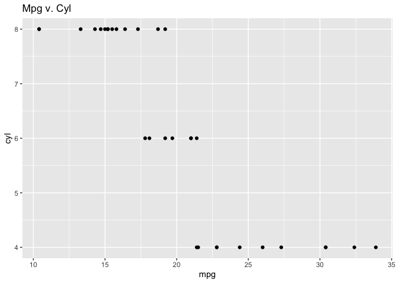
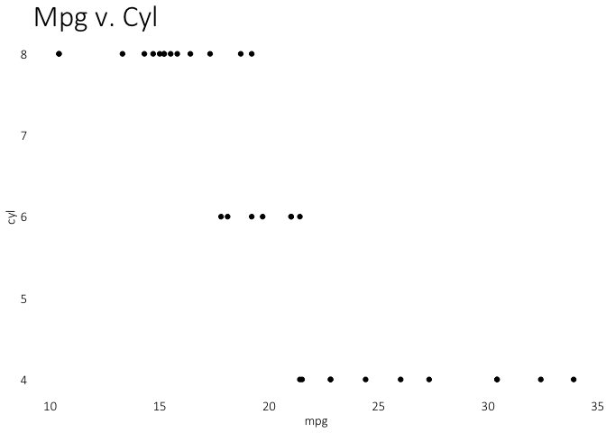
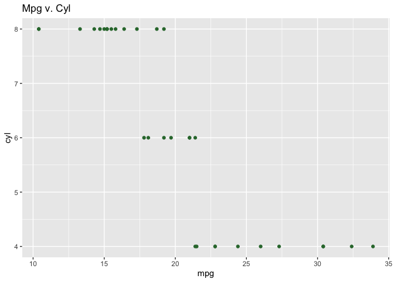

mointeRing repoRt 0.0.0.9000
============================

[Edgar Zamora \| Twitter:
`@Edgar_Zamora_`](https://twitter.com/Edgar_Zamora_)

The `mointoRingrepoRt` package is a collection of functions that will
aid in the production of the Annual [Mission Fulfillment Monitoring
Report](https://www.bigbend.edu/monitoring-reports/) that is produced by
the Big Bend [Institutional Research and Planning
Department](https://www.bigbend.edu/information-center/institutional-research-planning/).

To install the `mointoRingrepoRt` package run the following code:

``` r
devtools::install_github("Edgar-Zamora/mointoRingrepoRt")
```

Student Success
===============

The student success section of the mission fulfillment covers things
like Full-time Equivalent Enrollment (FTE), Student Achievement
Initiative (SAI) points, and many other aspects. To help with some of
these aspects, we create some functions that can retrieve and plot the
desired data.

Total student FTE (Full‐timeEquivalent)
---------------------------------------

BBCC Branding
=============

To provide uniform branding throughout the Mission Fulfillment Report,
there are two functions that can be used.

`bbcc_theme()`
--------------

By using the `bbcc_theme()` function while building a graphic will
modify non-data components of the data plot. It is recommended that this
function be used every time a graphic is created as to have consistency
between graphs. All of the modifiable parts of a graphic, the
`bbcc_theme()` only focuses on a few including text, grid, legend, and
strip elements.

Below is a plot that uses is the default theme.

``` r
plot <- mtcars %>%
  ggplot(aes(mpg, cyl)) +
  geom_point() +
  labs(
    title = "Mpg v. Cyl"
  )

plot
```



As you can see above the theme may not be exactly what we would be
looking for. Instead of changing every plot individually, we can just
call the `bbcc_theme()` function.

``` r
plot +
  theme_bbcc() +
  theme(
    plot.title = element_text(size = 25)
  )
```



As you can see, using the `theme_bbcc()` function changes the plot
without needing to individually specify each element. This will avoid
the potential to forget something if all the plots that are bound to be
included. Using the bbcc theme also does not repress the ability to use
the regular theme component for those elements that are particular to a
plot.

`bbcc_cols()`
-------------

In addition to adding a function to change plot themes, we include the
`bbcc_cols()` function to access the official hex colors of Big Bend.
Currently there are two colors, *green* and *dark blue*, with the
possibility of adding others. To view all the currently available colors
you can run the function without any arguments.

``` r
bbcc_cols()
```

    ##     green dark blue 
    ## "#30763a" "#132048"

Helping with uniformity, the colors can also be assigned to different
`geoms_` in a plot. Currently it is only possible to assign color as a
constant value and can not be made an aesthetic. Below is an example of
this.

``` r
mtcars %>% 
  ggplot(aes(mpg, cyl)) +
  geom_point(color = bbcc_cols("green")) +
  labs(title = "Mpg v. Cyl")
```



As you can see, it is necessary to specificy which calor you would like
included as an argument within the function.
